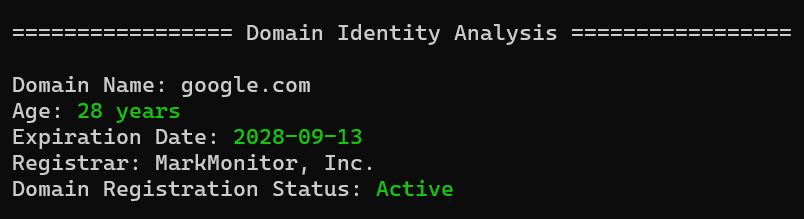
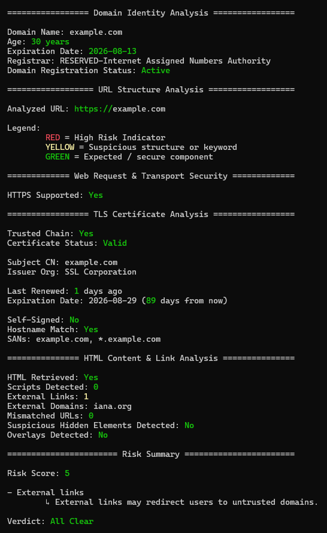
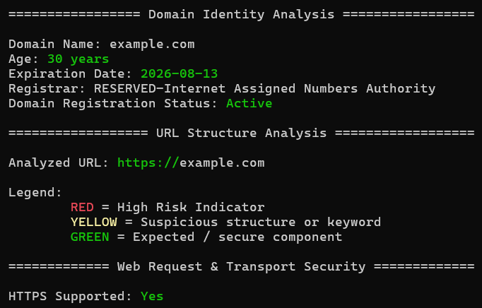
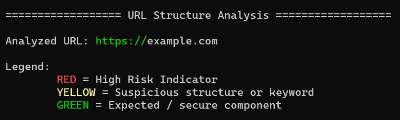
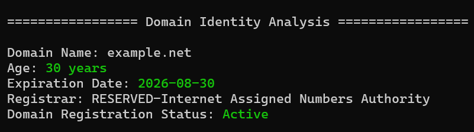
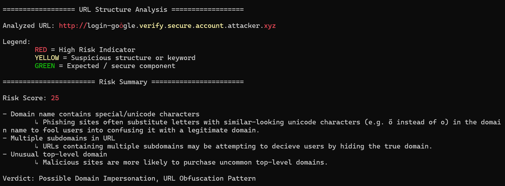
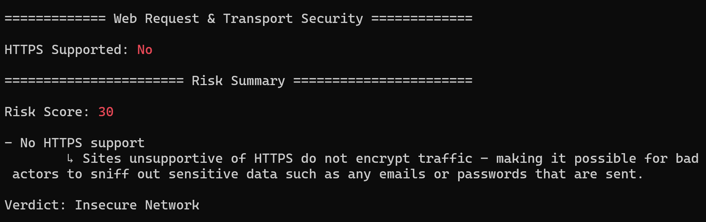
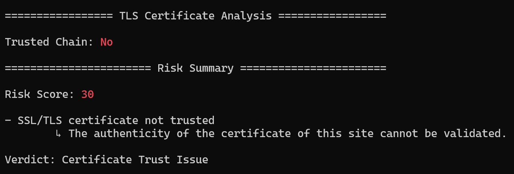
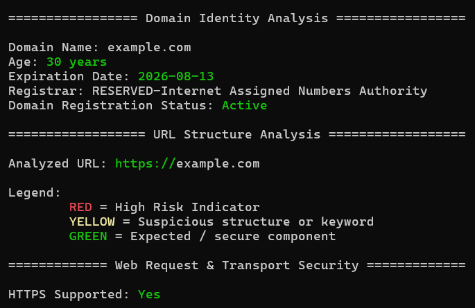

# Link Analyzer

[](https://www.python.org/)


## Description
***Link Analyzer*** is a command-line tool designed to inspect and evaluate the security posture of a given URL. It performs multi-layered analysis across domain identity, URL structure, transport security, TLS certificates, and HTML/CSS behavior to detect common phishing and malicious patterns.

The tool aggregates low-level signals (e.g., domain age, mismatched links, hidden elements) into higher-level insights, helping users identify potentially unsafe or deceptive websites.

Key capabilities include:
- Domain registration and lifecycle analysis
- URL structure and obfuscation detection
- HTTPS and TLS certificate validation
- HTML and CSS behavior analysis (e.g., overlays, hidden elements)
- Explainable risk signals for educational insight

## Features

- 🔍 Multi-layer URL inspection pipeline (domain → transport → content)
- 🧠 Signal-based risk detection with rule-based reasoning
- 🔐 TLS and certificate validation (including edge cases)
- 🌐 URL structure and obfuscation analysis
- 🎭 HTML/CSS behavior detection (hidden elements, overlays, deceptive links)
- 📖 Explainable outputs with human-readable security insights


## Usage Instructions
1. Download python from the official website ([https://www.python.org/downloads/](https://www.python.org/downloads/)) if you have not already done so.
2. Clone/download a copy of this repository.
3. Open your terminal and navigate to the project folder.
4. Create a virtual environment within the folder by typing in `python -m venv venv` and pressing enter.
    - Confirm that the `venv/` folder exists with: `ls` for Linux/macOs or `dir` for Windows.
5. Activate the environment
    - On Windows, this is done via: `venv\Scripts\Activate`.
    - On Linux/macOS, this is done via: `source venv/bin/activate`.
6. Install the necessary packages with into the environment: `pip install -r requirements.txt`.
7. Run the program by running the example commands below.


## Notes

- All domains used in the following examples are safe, publicly documented, or reserved for testing purposes (e.g., example.com, badssl.com, neverssl.com).


## Commands and Outputs

### Legend

- ✅ <span style="color:#22c55e">GREEN</span> = Expected / secure component  
- ⚠️ <span style="color:#eab308">YELLOW</span> = Suspicious indicator  
- ❌ <span style="color:#ef4444">RED</span> = High-risk signal  

Usage:
```bash
python main.py <url> [options]
```

### Case #1: Default Scan
```bash
python ./main.py google.com
```


### Case #2: Full Analysis
```bash
python ./main.py https://example.com --full
```


### Case #3: Excluding Specific Analysis

```bash
python ./main.py example.com --exclude --html --tls_cert
```


### Case #4: Offline Analysis
```bash
python ./main.py example.com --offline
```


### Case #5: Domain Identity Analysis
```bash
python ./main.py example.net --domain_identity
```


### Case #6: Structural URL Analysis
```bash
# Intentionally spoofed URL for demonstration
python ./main.py http://login-goȱgle.verify.secure.account.attacker.xyz --url_structure
```


### Case #7: Transport Security Analysis
```bash
python ./main.py http://neverssl.com/ --transport_security
```


### Case #8: SSL/TLS Certificate Analysis
```bash
python ./main.py https://expired.badssl.com --tls_cert
```


### Case #9: HTML/CSS Behavior Analysis
```bash
python ./main.py example.com --html
```

